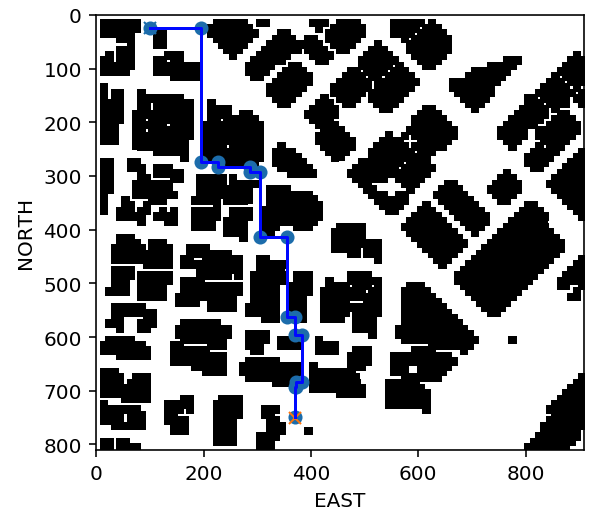

# AAE_Notebook_008_PutItTogether
Thanks to the steps taken in previous notebooks, we now have the needed tools to implement a full planning solution.

### Steps
  1. Read in map of environment (colliders.csv) and create a grid representation of the environment.
  2. Define start and goal locations, as well as a heuristic, and run A* through the grid to find a path of cells.
  3. Use collinearity and/or Bresenham to eliminate unnecessary waypoints.

